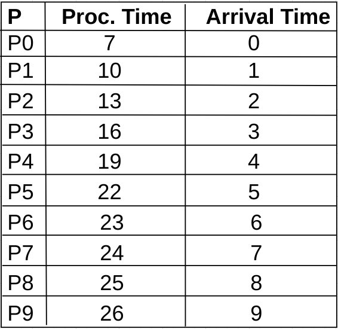
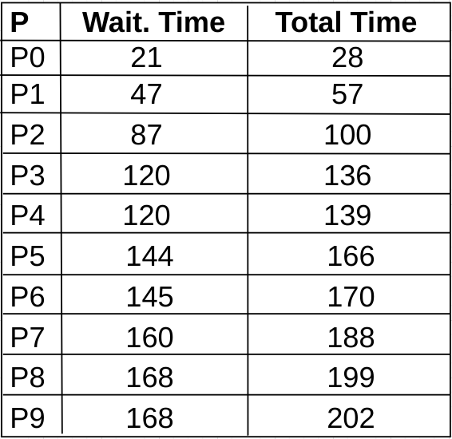
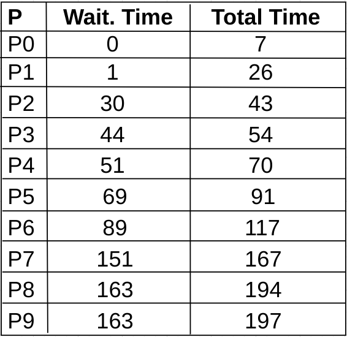

# Sobre

O **Escalonador** é um simulador de escalonador de processos de um sistema operacional.
Um escalonador de processos é um componente de sistemas operacionais modernos que gerencia uma fila de processos com base em algum método ou algoritmo.
Os principais são: 
    . **First Come First Served (FCFS)**: a prioridade se dá de acordo com a ordem de chegada de cada processo, nesse caso, o primeiro a chegar é o primeiro a ser "servido".
    . **Shortest Job First (SJF)**: a prioridade se dá de acordo com o tempo de execução total do processo, nesse caso, o processo com menor tempo de execução será o primeiro a executar.
    . Shortest Remaining Time First (SRT)
    . **Roud-robin**: O escalonador define um quantum (fatia de tempo) para cada processo. Quando o quantum termina, o processo deve ceder a CPU para outro.
    . Randomic
O **Escalonador** implementa os algoritmos FCFS e SJF com round-robin.

# Começando

Para rodar o programa é necessário ter o python3 previamente instalado.
Debian:
sudo apt install python3

Para clonar o repositório também é necessário ter instalado o git:
Debian:
sudo apt install git

Em seguida:
git clone https://github.com/Y4ngfr/Escalonador.git

Por fim basta executar o arquivo main.py:
python3 src/main.py

# Executando

No inicio da execução do programa, deve-se selecionar o algoritmo desejado (entre FCFS e SJF). Após isso, precione enter para avançar um passo na execução do programa.
A cada passo o programa fará internamente as seguintes ações: 
    . criará um novo processo em 69% das vezes
    . adicionará o processo na fila de processos
    . irá imprimir na tela a fila de processos e a fila de espera
    . irá executar o primeiro processo da fila (caso haja)
    . irá "alimentar" a entrada para o primeiro processo da fila de entrada
    . irá atualizar a fila de processos
    . irá atualizar a fila de espera
Importante mencionar que a impressão das filas segue o padrão:
IdProcesso(x0)Prioridade(x1)TempoExecução[x2]TempoEspera[x3]Estado(x4)

# Arquitetura

A arquitetura é composta essencialmente por 4 contextos principais: Escalonador, Processo, SO e Despachante

# Escalonador

O escalonador é composto por 3 classes: EscalonadorAbstrato, EscalonadorFCFS e EscalonadorSJF.
A principal função dessas 3 classes é criar e gerenciar uma fila de processos de acordo com o algoritmo selecionado pelo usuário. Além disso também é gerenciada uma fila de espera, onde estão os processos que aguardam pela entrada do usuário (evento simplificado no simulador). Na fila de espera o algoritmo implementado é o FCFS.
O EscalonadorAbstrato implementa os atributos e alguns métodos gerais que serão utilizados pelas duas classes filhas, os principais são atualiza_fila_processos e atualiza_fila_espera.
O EscalonadorFCFS implementa a ação de adicionar à fila de processos conforme a ordem de chegada, nesse caso ele sempre adiciona processos novos no final da fila.
O EscalonadorSJF implementa a ação de adicionar à fila de processos conforme o tempo de execução ...

# Processos

O processo é uma classe que possui id, tempo de execução, estado (pode ser Pronto, Esperando, Executando ou Terminado), tempo de espera e prioridade.
Os processos prontos ficam aguardando na fila de processos para receberem uma oportunidade de executar pelo escalonador. Durante a execução de um processo, existe sempre uma chance de ele precisar de alguma entrada do usuário. Essa chance é simulada como um número gerado aleatóriamente, e caso o evento ocorra, o processo ficará no estado Esperando e saíra da lista de processos para ser colocado na fila de espera.
Os processos com estado Terminado são removidos da fila de processos pelo escalonador.

# Sistema Operacional

O sistema operacional centraliza as ações de cada uma das classes. A sua principal finalidade é dar modularidade ao projeto, deixando o código mais organizado e limpo, visto que seria possível implementar o escalonador sem a necessidade de estar dentro de um contexto de um sistema operacional.
Ele é implementado na classe SO, e possui um escalonador e um despachante, que serão únicos durante todo o fluxo de execução do programa.

# Despachante

O despachante é responsável por encapsular o contexto onde o processo é executado.
Depois que um processo é escolhido pelo escalonador (primeiro da fila), o despchante é chamado, enviando como parâmetro o processo em questão. O despachante então tem a função principal de alocar um quantum para o processo e garantir que ele seja executado até esse tempo acabar. 

# Estudo de Caso

Foi realizado um teste com cada algoritmo para comparar o desempenho entre os dois.
Ambos foram submetidos ao seguinte conjunto de processos:

Ao final das duas execuções obtivemos os seguintes resultados:

# Resultado FCFS

tempo médio de turnaround: 138.5

# Resultado SJF

tempo médio de turnaround: 96.6

Podemos perceber que o tempo médio de turnaround é significativamente menor no algoritmo de SJF, isso ocorre pois os tempos de espera são reduzidos ao máximo adotando a estratégia do processo com menor tempo de execução executar primeiro. Porém vale destacar que esse algoritmo possui alguns problemas em relação ao algoritmo anterior, pois processos que possuem um elevado tempo de execução esperam muito mais que os outros, o que pode causar starvation. A forma de resolver isso é incrementar a prioridade dos algoritmos que estão esperando a mais tempo. Porém isso adiciona uma complexidade a mais no algoritmo, pois a cada vez que as prioridades forem incrementadas teremos que percorrer a fila de processos quase inteiramente, o que não é necessário no algoritmo FCSF. Também é bom mencionar que adotar uma estratégia de round-robin no algoritmo de SJF pode torna-lo confuso de entender e bem menos eficiente que o algoritmo de FCFS.
